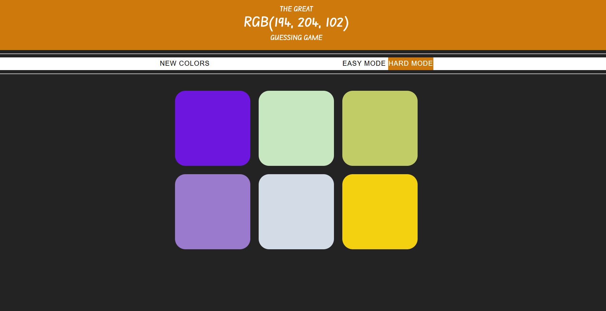
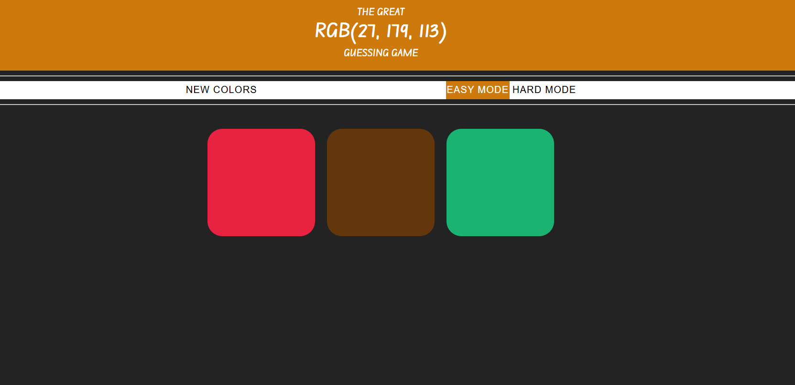

# 🎨 RGB Color Guessing Game

A fun and interactive web-based game where users try to guess the correct color from RGB values. Built using **HTML, CSS, and JavaScript** — no frameworks!


#

#


## 🕹️ How to Play

- You are shown an RGB color value (e.g., `rgb(255, 0, 0)`).
- Choose the correct color box that matches the RGB value.
- Each round, the colors change randomly.
- Score increases for correct guesses — try to beat your high score!

## 🚀 Live Demo

👉 [Play the game here](https://prabhatsingh001.github.io/RGB/)

## 📁 Project Structure

RGB/
├── index.html # Main HTML file
├── styles.css # CSS styling
├── script.js # JavaScript game logic
└── README.md # This file


## 🛠️ Technologies Used

- HTML5
- CSS3
- JavaScript

## 🧠 Features

- Dynamic RGB color generation
- Interactive UI with visual feedback
- Clean, responsive design
- Game logic with score tracking

## ✅ To Run Locally

1. Clone this repo:
   ```bash
   git clone https://github.com/prabhatsingh001/RGB.git
